# Soul Faith Assistant "Your Own Guide to Islam"

## Overview:
an android application—that serves as a virtual assistant and offers a variety of services, including listening to the Qur'an, Hadiths, reminding Muslims to pray, guiding them in the direction of the Qibla, listening to naat, get fast timings, get prayer timings, tell Islamic date, English date and offering common duas. Through voice interactions, the assistant will communicate with blind individuals and reacts appropriately in relation to the services offered by the app. User will interact with the application by giving voice input in Urdu language. Moreover, people who are not disabled can also benefit from it by using it.

## Features:
- Recitation of the Holy Quran
- Hadiths
- Dua
- Qibla Direction
- Ramadan Timing
- Prayer Timing
- Tasbeeh Counter
- Naat
- Islamic Date
- Fast Notification

## App Screens:
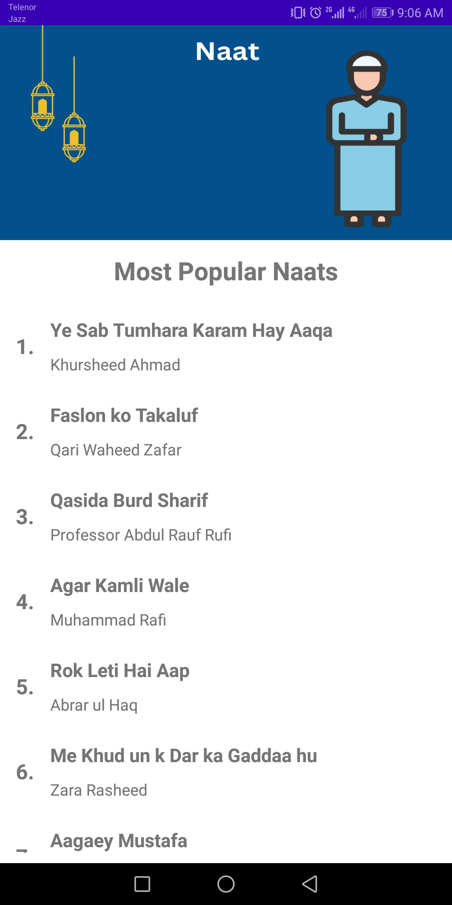

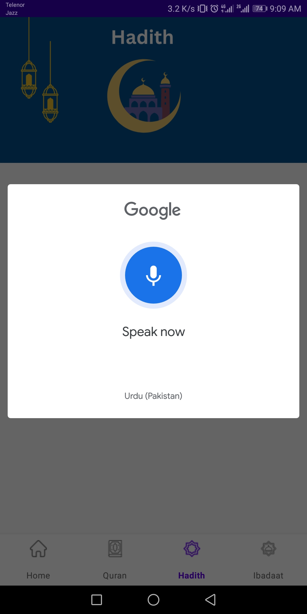
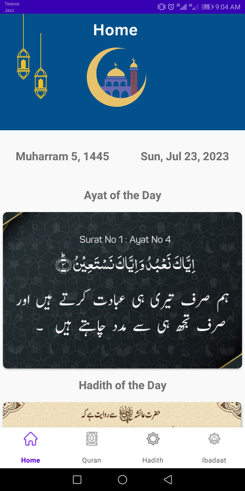 

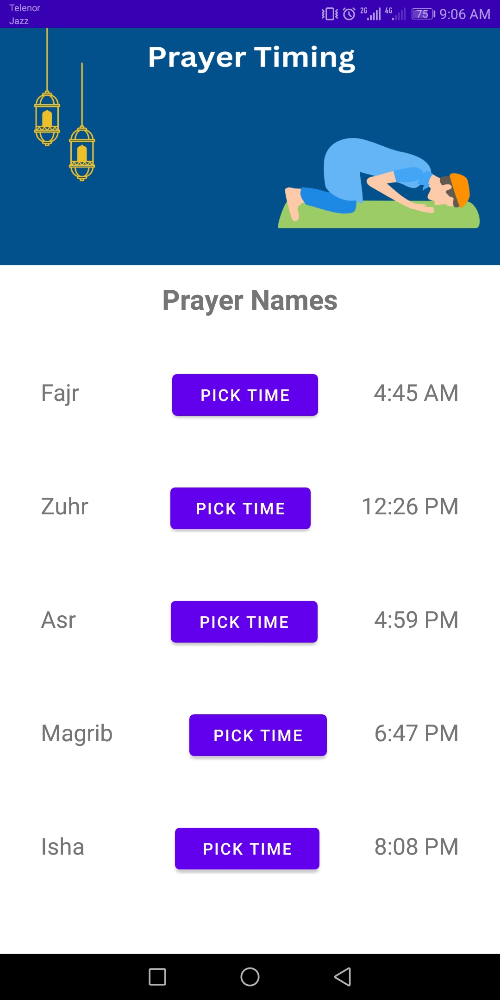
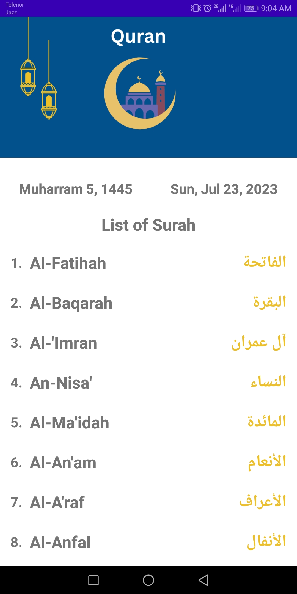
 

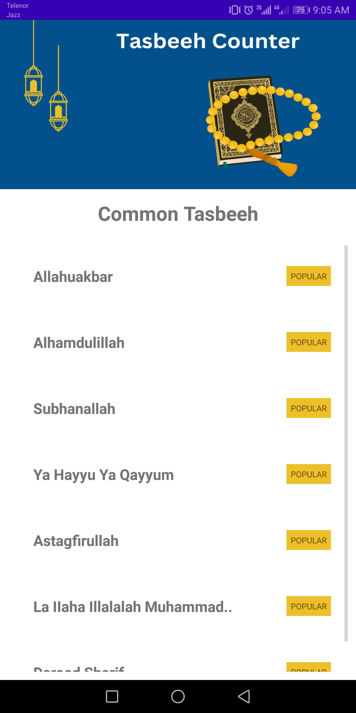
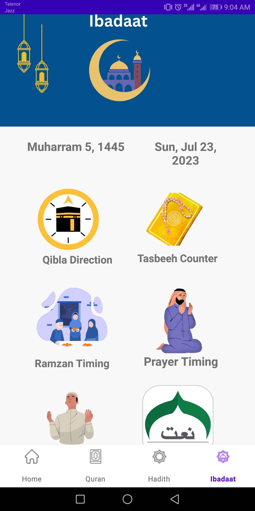 

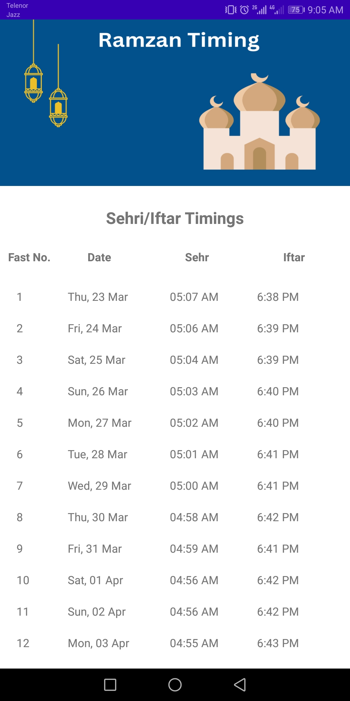
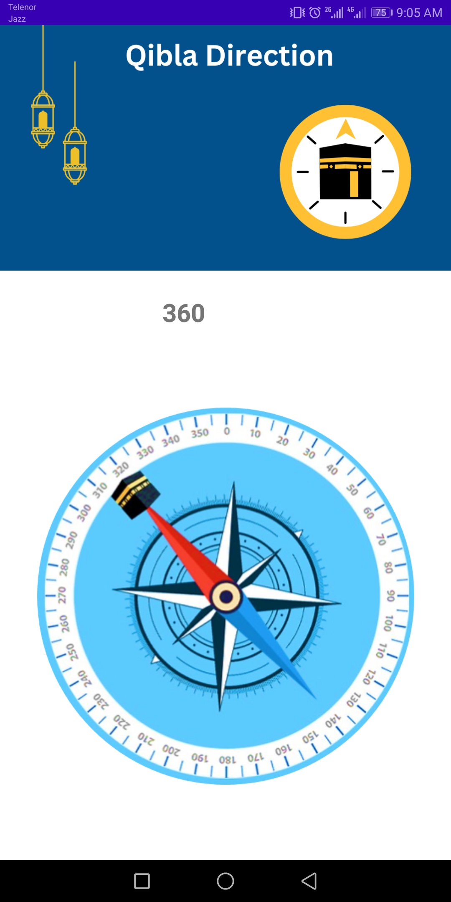
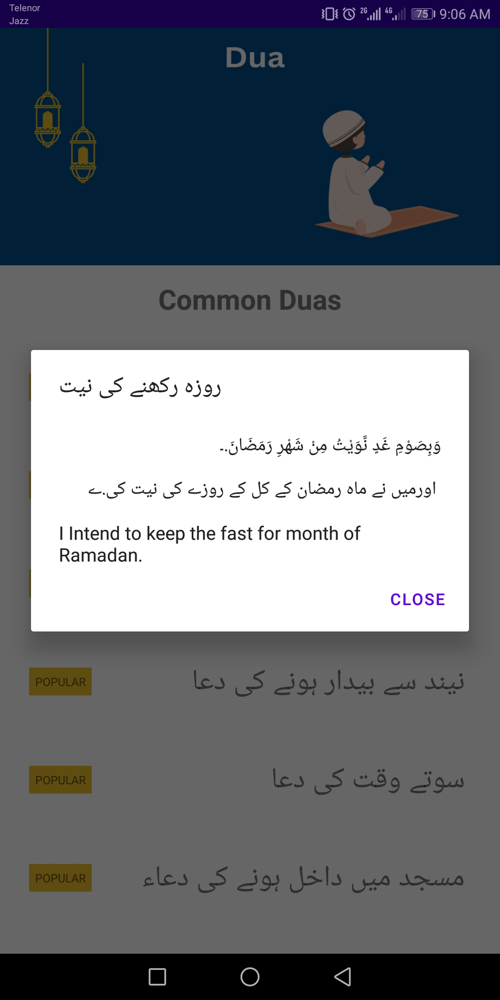 

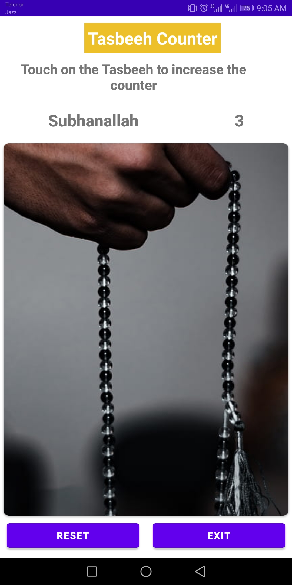 

